# Front-End Course.

# General

## 0. Git Basics
#### 1. Finish the course [Version Control with Git](https://classroom.udacity.com/courses/ud123)  
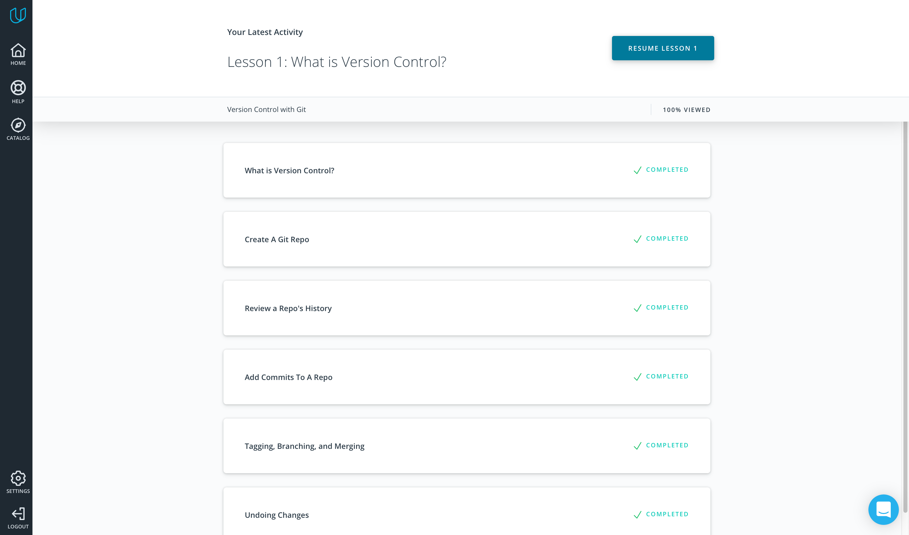  
It was new information for me about git log with different parameters. 
#### 2. Complete the following levels at [learngitbranching.js.org](learngitbranching.js.org):
- Main: Introduction Sequence
- Remote: Push & Pull -- Git Remotes  
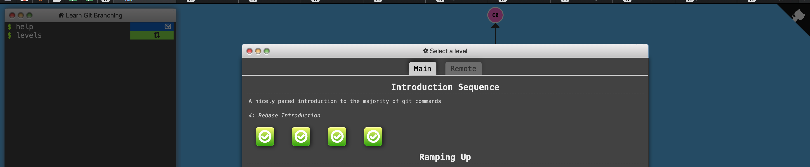  
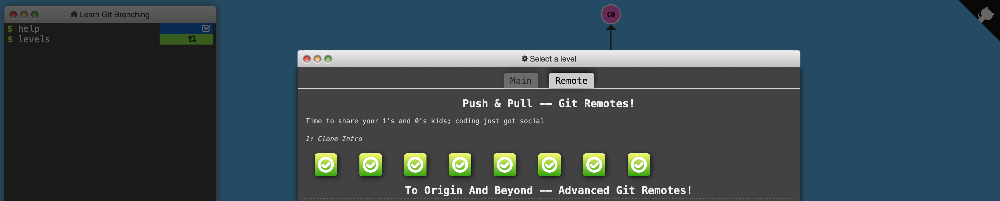  

I get some new information from second part about git merge/rebase.  
## Linux, Command Line, HTTP Tools
#### 1. [Linux Survival (4 modules)](https://linuxsurvival.com/linux-tutorial-introduction/)
Quizzes 1-4:
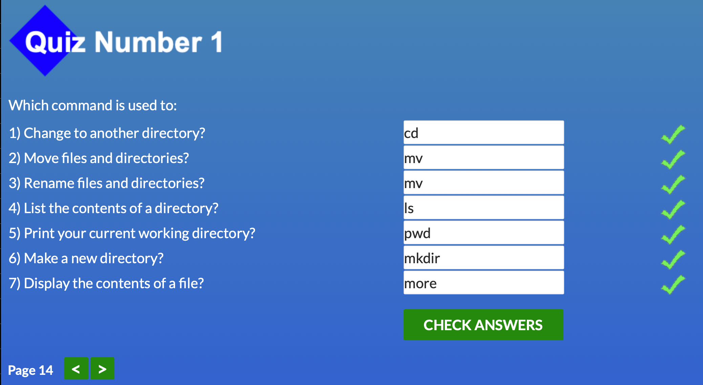
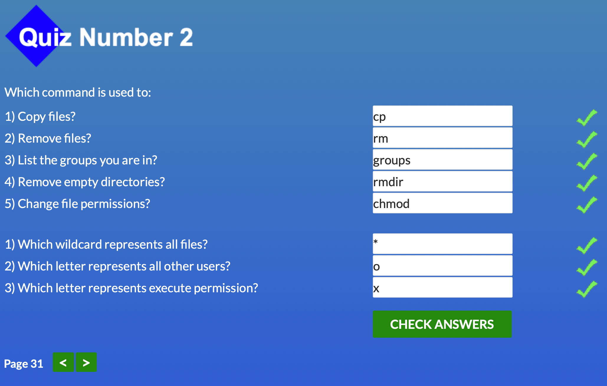
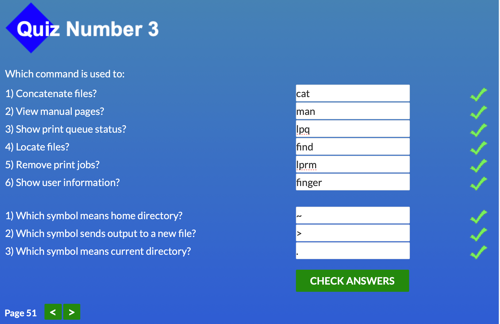
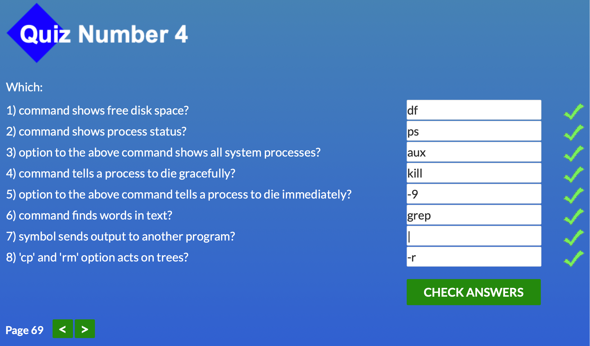  

There was a lot of new information about working with the terminal.
I also figured out better how the http / https protocol works.  

## Git Collaboration  
Complete the following:

#### 1. [GitHub & Collaboration](https://classroom.udacity.com/courses/ud456)
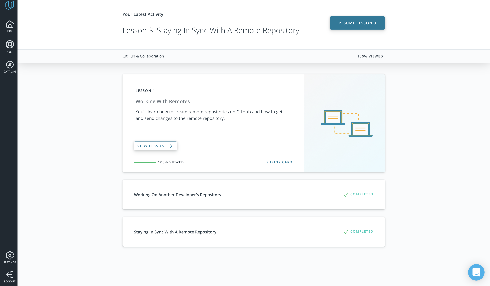  

Few new things that I didn't know before, for example HEAD ~ 3 and other navigation between commits.
#### 2. Complete the following levels at [learngitbranching.js.org](learngitbranching.js.org):

- Main: Ramping Up, Moving Work Around
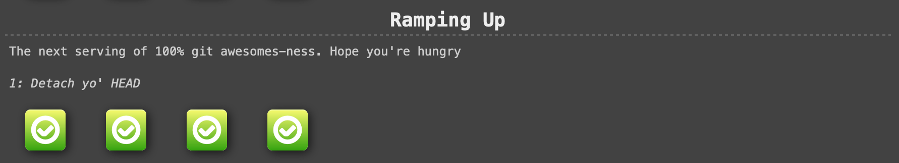
- Remote: To Origin and Beyond
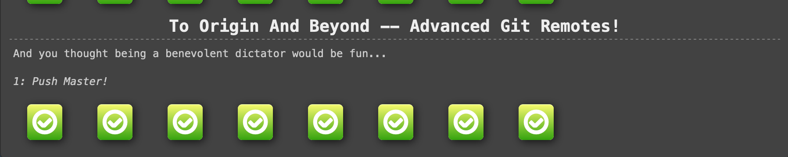

## Intro to HTML and CSS
- Intro to HTML & CSS (Eng) 
I was familiar with elementary html and css, so it wasn't anything new for me.
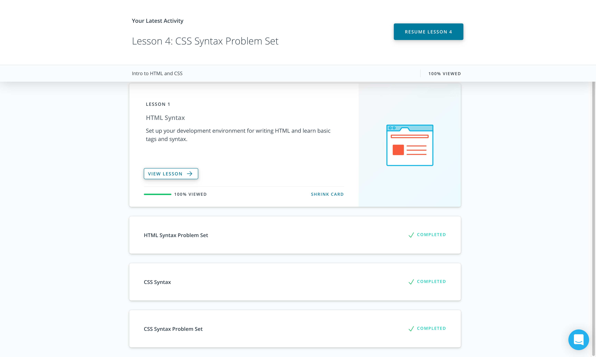
- Learn HTML(Eng)
- Learn CSS(Eng)
Grids and flexes are amazing. It's a lot of new information for me and I would like to practice it.  
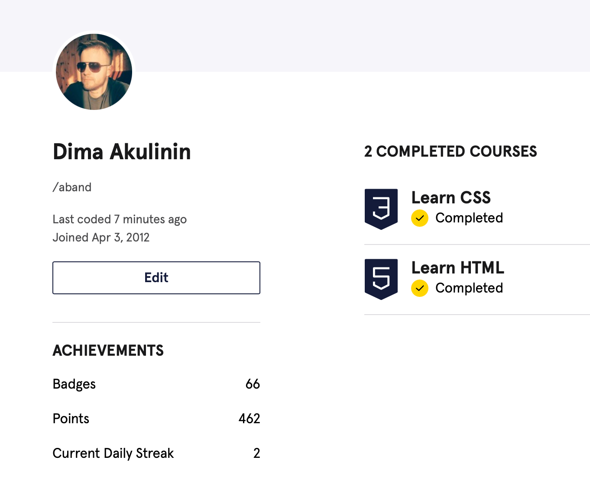  

## Responsive Web Design
- Responsive Web Design Fundamentals
Setting the viewport like <meta name="viewport" content="width=device-width, initial-scale=1.0"> in html code was new 
for me.

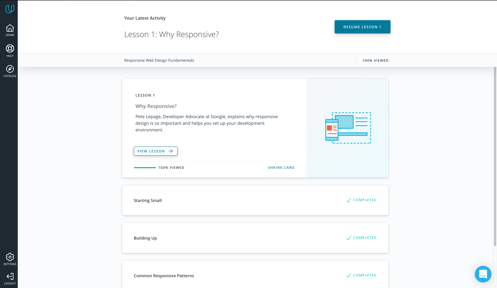
- Flexbox Froggy
It was useful to practice with froggy-flexbox.
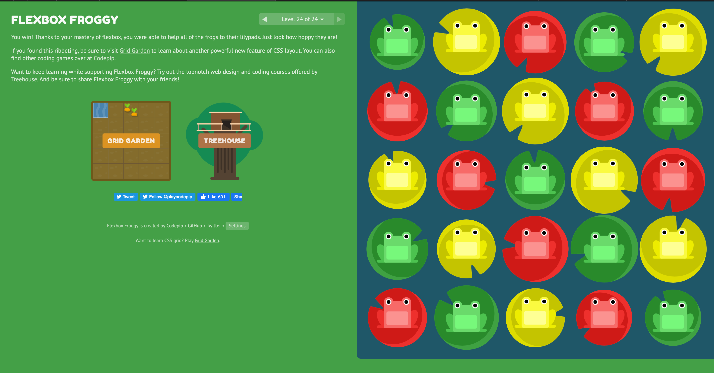
